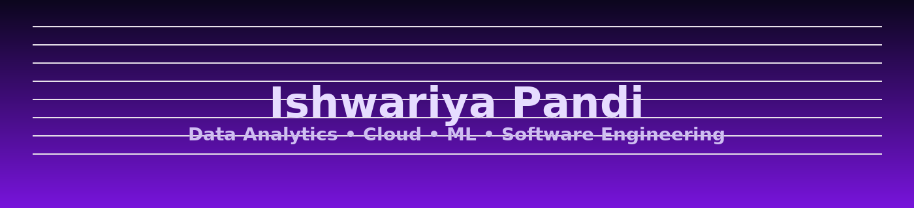

<!-- Purple Neon profile generated assets -->

  

  
  <h1 style="margin:10px 0 4px 0; color:#e6dcff;">✨ Ishwariya Pandi</h1>
  
Data Analytics • Cloud • ML • Software Engineering

---

  
  &nbsp;
  
  &nbsp;
  

---

## 👩‍💻 About me
Passionate about building cloud-enabled, data-driven systems and user-facing dashboards. I combine engineering rigor with visual storytelling.  
📫 Email: **ishupandi15@gmail.com** • 📍 United States

---

## ✨ Animated Skills

  
  &nbsp;&nbsp;
  
  &nbsp;&nbsp;
  

---

## 🚀 Featured Projects

  <a href="https://github.com/ishupandi15/Heart-Disease-Dashboard" style="text-decoration:none;">
    

      <h3 style="color:#e8dcff; margin:0 0 8px 0;">Heart-Disease-Dashboard</h3>
      
UCI Cleveland analysis + responsive dashboard built with HTML & Tableau.

      
<strong>Tech:</strong> HTML • Tableau • JS

    

  </a>

  <a href="https://github.com/ishupandi15/StudentDynamoDBProject" style="text-decoration:none;">
    

      <h3 style="color:#e8dcff; margin:0 0 8px 0;">StudentDynamoDBProject</h3>
      
CRUD app with AWS DynamoDB & S3 — backend-focused student records system.

      
<strong>Tech:</strong> AWS • Python • DynamoDB

    

  </a>

  <a href="https://github.com/ishupandi15/computer-vision-projects" style="text-decoration:none;">
    

      <h3 style="color:#e8dcff; margin:0 0 8px 0;">computer-vision-projects</h3>
      
License plate detection + fire detection prototypes (OpenCV).

      
<strong>Tech:</strong> Python • OpenCV • ML

    

  </a>

---

## 🔗 Connect & Socials

  
  &nbsp;&nbsp;
  
  &nbsp;&nbsp;
  

✨ Building meaningful tech, one commit at a time.

